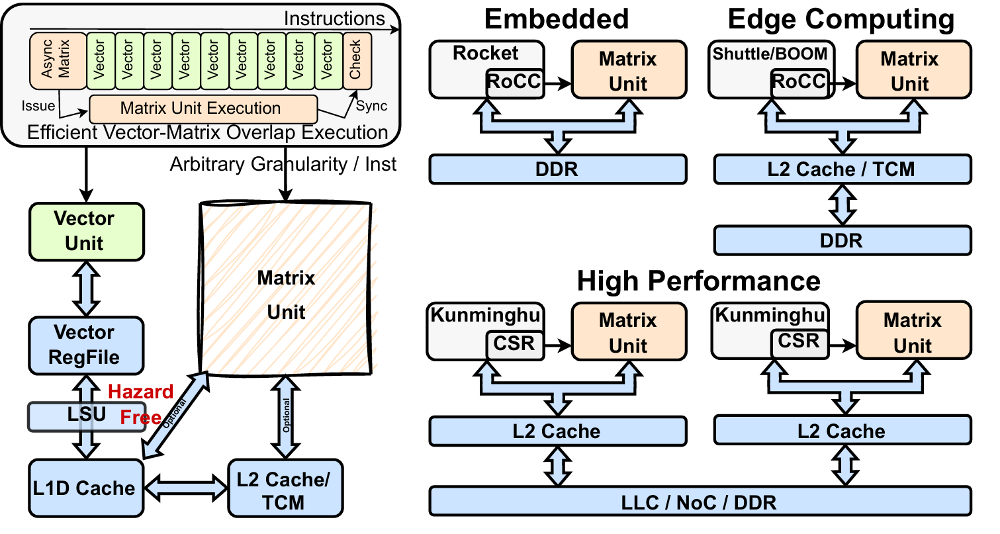
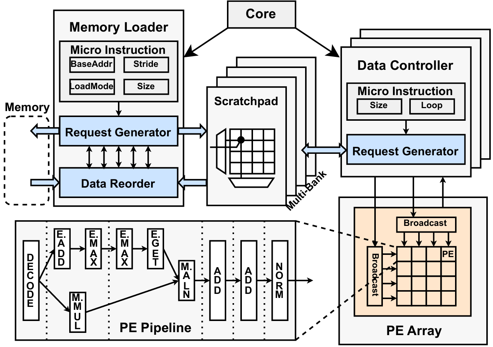

# CUTE
CUTE is an CPU-centric and Ultra-utilized Tensor Engine project.

中文说明在此[WIP]。

## Documentation

## Publications

[CUTE: A scalable CPU-centric and Ultra-utilized Tensor Engine for convolutions](https://www.sciencedirect.com/science/article/pii/S1383762124000432)

Paper PDF | IEEE Xplore | BibTeX | Presentation Slides | Presentation Video

## Architecture

## Micro-Architecture

## Sub-directories Overview
Some of the key directories are shown below.

```
.
├── src
│   └── main/scala         # design files
│       ├── CUTETOP.scala  # top module
├── cute-fpe               # mixed-precision PE project
│   ├── fpe                # RTL implementation of mixed-precision PE
│   └── ccode              # C code of gloden of float
├── cutetest               # C code implementation of different workloads project
│   ├── base_test          # basic conv/gemm test and basic software helper
│   ├── dramsim_config     # dramsim config for different dram bandwidth
│   ├── gemm_test          # different gemm test
│   ├── resnet50_test      # different resnet50 conv-vector fuse kernel test
│   └── transformer_test   # different bert&llama gemm-vector fuse kernel test
├── scripts                # scripts for agile development
├── chipyard               # Chipyard is an open source framework for agile development of Chisel-based systems-on-chip
├── CPU                    # List of CPUs with completed integration
│   ├── boom               # out-of-order superscalar core (BOOM)
│   ├── rocket             # in-order 1-issue core (Rocket)
│   └── shuttle            # in-order superscalar core (Shuttle)
```

## Prepare environment

"Before executing all subsequent steps, please complete the environment initialization first!"
```bash 
$ ./scripts/setup-env.sh
[CUTE-Setup-step-1] Script absolute path: .....

[CUTE-Setup-step-2] Updating CUTE git submodules.....
.....
[CUTE-Setup-step-2] CUTE git submodules updated.
.....

[CUTE-Setup-step-3] Setting up chipyard environment...
.....
[CUTE-Setup-step-3] Chipyard environment setup complete.

[CUTE-Setup-step-4] WIP : Additional setup steps will be added soon.
```


## Generate Verilog

Refer to the `build/chipyard/config/CuteConfig.scala` file, where the available CUTE SoC configuration codes generated from Chipyard are listed. Based on your needs, you can generate the corresponding SoC. The command below illustrates a full Verilog generation workflow.

```bash 
$ ./scripts/build-verilog.sh CUTE2TopsSCP64Config
[Verilog-Generate-step-1] Script absolute path: /root/opencute/CUTE/scripts
[Verilog-Generate-step-1] CUTE root absolute path: /root/opencute/CUTE

[Verilog-Generate-step-2] Using Chipyard Generating Verilog files with CONFIG=CUTE2TopsSCP64Config ...
.....
[Verilog-Generate-step-2] Verilog files generation complete.
all files are located at: .....
all soc verilog files are shown in the .....
all verilog files are located at: .....
```

## Generate CUTE-Test

Use `scripts/setup-get-rvv-toolchain.sh` to install the RISC-V toolchain. 

```bash 
[Setup-Rvv-toolchain-step-1] Script absolute path: .....
[Setup-Rvv-toolchain-step-1] CUTE root absolute path: .....

[Setup-Rvv-toolchain-step-2] Download the precompiled RISC-V Vector (RVV) toolchain...
.....
[Setup-Rvv-toolchain-step-2] RVV toolchain download and extraction complete.

RVV toolchain is set up at: .....
```

Then, with `scripts/build-cute-test.sh`, you can compile various bare-metal binaries that can be executed on the Verilator simulator. 

```bash 
$ ./scripts/build-cute-test.sh
[CUTE-Test-Generate-step-1] Script absolute path: .....
[CUTE-Test-Generate-step-1] CUTE root absolute path: .....

.....

[CUTE-Test-Generate-step-2] Generating CUTE test programs...
.....

[CUTE-Test-Generate-step-3] Generating CUTE base test programs...
.....
[CUTE-Test-Generate-step-3] CUTE base test programs generation complete.

[CUTE-Test-Generate-step-4] Generating CUTE GEMM benchmark test programs...
.....
[CUTE-Test-Generate-step-4] CUTE GEMM benchmark test programs generation complete.

[CUTE-Test-Generate-step-5] Generating CUTE ResNet50 benchmark test programs...
.....
[CUTE-Test-Generate-step-5] CUTE ResNet50 benchmark test programs generation complete.

[CUTE-Test-Generate-step-6] Generating CUTE Transformer benchmark test programs...
.....

[CUTE-Test-Generate-step-6] Generating CUTE Transformer BERT benchmark test programs...
.....
[CUTE-Test-Generate-step-6] CUTE Transformer BERT benchmark test programs generation complete.

[CUTE-Test-Generate-step-7] Generating CUTE Transformer LLaMA benchmark test programs...
.....
[CUTE-Test-Generate-step-7] CUTE Transformer LLaMA benchmark test programs generation complete.


[CUTE-Test-Generate-step-*] WIP : tests will be added soon.


[CUTE-Test-Generate-step-8] All CUTE test programs generation complete.
All test programs are located at: .....

```

For the detailed compilation process and the corresponding execution flow, please refer to the C files and Makefiles in the specific folders.


## Run Programs by Simulation


### Prepare environment
Please make sure you have completed the [“Generate CUTE-Test”](#generate-cute-test) and [“Generate Verilog”](#generate-verilog) processes first! Then proceed with the following steps.
### Build simulator

By executing `scripts/build-simulator.sh`, you can compile the simulator produced by Verilator.

```bash
./scripts/build-simulator.sh CUTE2TopsSCP64Config
[Simulator-Generate-step-1] Script absolute path: .....
[Simulator-Generate-step-1] CUTE root absolute path: .....

[Simulator-Generate-step-2] Using Chipyard Generating Simulator with CONFIG=..... ...
.....
[Simulator-Generate-step-2] Simulator files generation complete.
all files are located at: .....
all soc verilog files are shown in the .....
all verilog files are located at: .....

[Simulator-Generate-step-3] New binary is identical to latest one ...... Skip copying.
```

### Run simulator with cutetest
Execute the following command to test a specific binary. For more details on the execution process, see the provided script.
```bash
./scripts/run-simulator-test.sh CUTE2TopsSCP64Config /root/opencute/CUTE/cutetest/base_test/cute_Matmul_mnk_128_128_128_zeroinit.riscv
[Simulator-Test-step-1] Script absolute path: .....
[Simulator-Test-step-1] CUTE root absolute path: .....

[Simulator-Test-step-2] Using Chipyard Generating Simulator with .....
.....
[Simulator-Test-step-2] Simulator Test complete.

Debug Info at .....
UART log at .....
```
